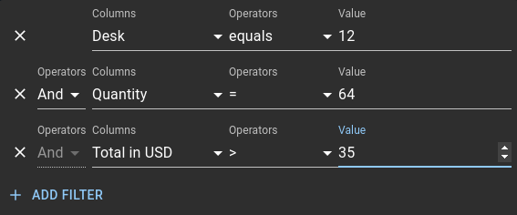

# Filtering

## Structure

### Data

First, let's see how the filtering is saved in the state. Here are the types of the [filter model](https://mui.com/x/api/data-grid/grid-filter-model/). It is made of a `linkOperator`, and a list of [items](https://mui.com/x/api/data-grid/grid-filter-item/). Each item corresponds to a line in the filtering panel.

```ts
interface GridFilterModel {
  items: GridFilterItem[];
  linkOperator?: GridLinkOperator;
}

interface GridFilterItem {
  id?: number | string;
  field: string;
  value?: any;
  operator: string;
}

enum GridLinkOperator {
  And = 'and',
  Or = 'or',
}
```

### Interface



All the components of the filter panel are in `components/panel/filterPanel`.
The component tree structure is organized as follow:
The `<GridFilterPanel/>` renders a `<GridFilterForm/>` for each `item` of the filter model.
The input component is provided by the developers.
Default ones are defined in `x-data-grid/scr/colDef/` files ending by "Operators" such as `gridSingleSelectOperators.ts`.

## Technical dept and tricky points
